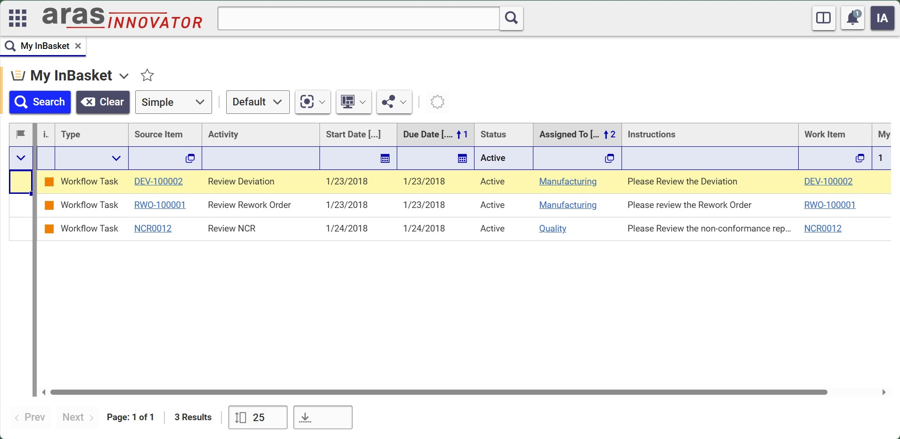

# Show 'My InBasket' on Login

<figure><figcaption>
My InBasket View
</figcaption></figure>

## Instructions



### Login




### Open My InBasket

Expand the TOC and select Administration > My Innovator > My InBasket

<figure><figcaption>
Open My InBasket
</figcaption></figure>



### Set Login View User Preference

Open the user menu at the top right corner of the screen and click Preferences > Set Tabs as Login View.

<figure><figcaption>
User Preferences Menu
</figcaption></figure>




These steps allow you to choose any tab as your starting view—it even works with multiple tabs!


## Try It Out!

To confirm your new preference setting, log out of Aras Innovator and log in again. From now on, the My InBasket view will automatically open after login.

<figure><figcaption>
My InBasket
</figcaption></figure>

